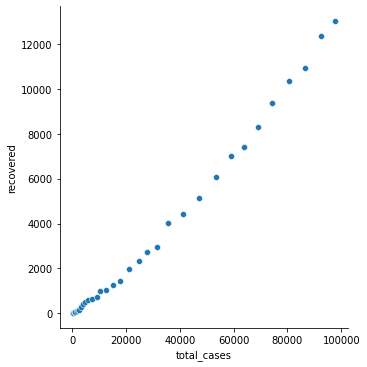
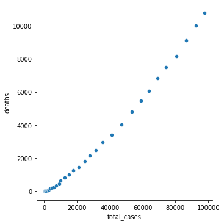
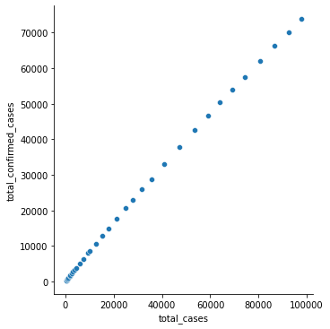
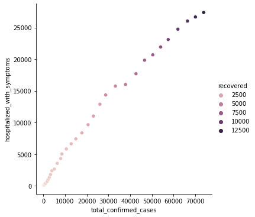
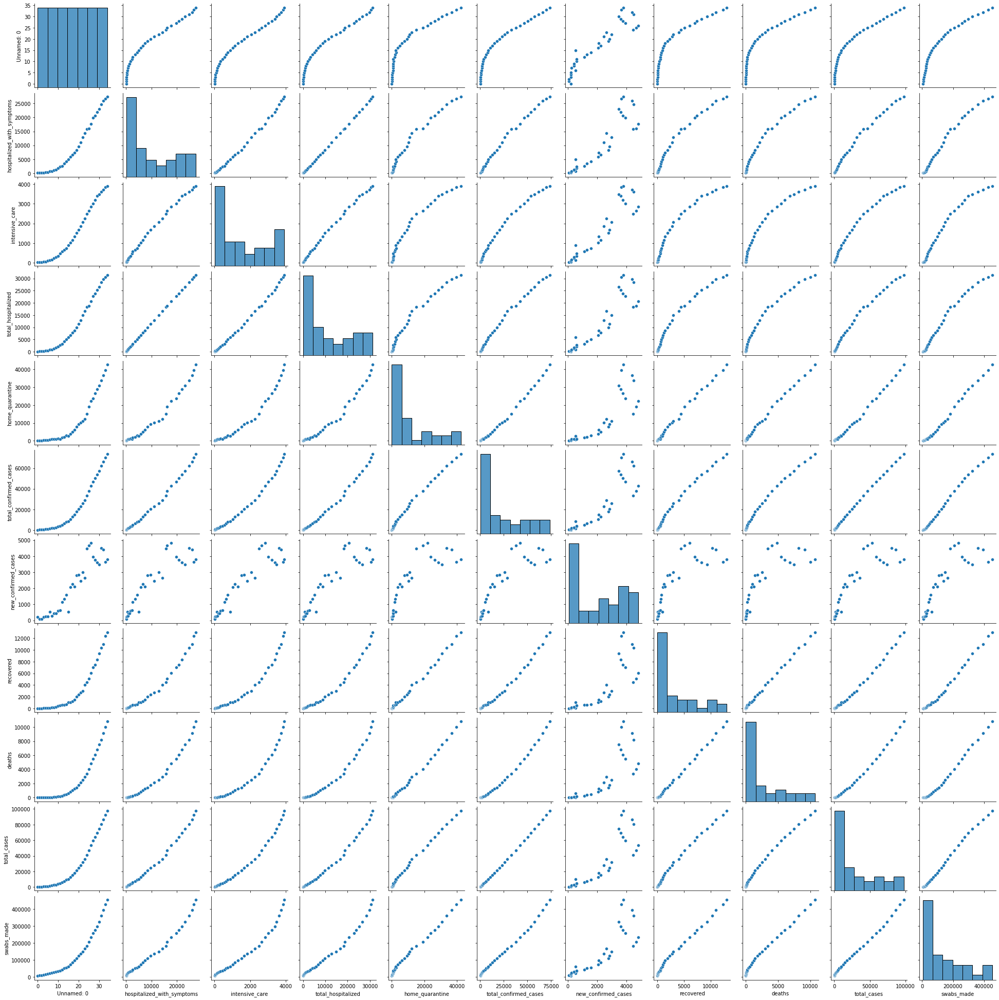
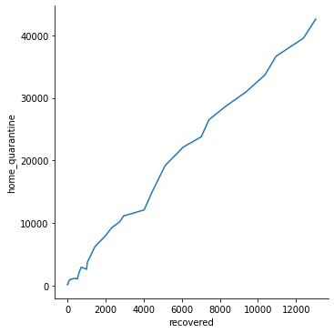
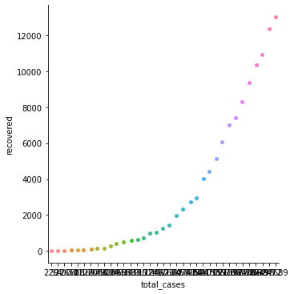
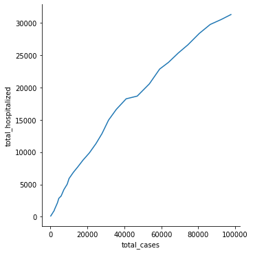

```python
import pandas as pd
import numpy as np
import seaborn as sns
import matplotlib.pyplot as plt

```


```python
data=pd.read_csv(r"C:\Users\DELL\Documents\covid\covid.csv")
```


```python
data.head()
```


<div>
<style scoped>
    .dataframe tbody tr th:only-of-type {
        vertical-align: middle;
    }

    .dataframe tbody tr th {
        vertical-align: top;
    }

    .dataframe thead th {
        text-align: right;
    }
</style>
<table border="1" class="dataframe">
  <thead>
    <tr style="text-align: right;">
      <th></th>
      <th>Unnamed: 0</th>
      <th>date</th>
      <th>state</th>
      <th>hospitalized_with_symptoms</th>
      <th>intensive_care</th>
      <th>total_hospitalized</th>
      <th>home_quarantine</th>
      <th>total_confirmed_cases</th>
      <th>new_confirmed_cases</th>
      <th>recovered</th>
      <th>deaths</th>
      <th>total_cases</th>
      <th>swabs_made</th>
      <th>note_it</th>
      <th>note_en</th>
    </tr>
  </thead>
  <tbody>
    <tr>
      <th>0</th>
      <td>0</td>
      <td>2020-02-24T18:00:00</td>
      <td>ITA</td>
      <td>101</td>
      <td>26</td>
      <td>127</td>
      <td>94</td>
      <td>221</td>
      <td>221</td>
      <td>1</td>
      <td>7</td>
      <td>229</td>
      <td>4324</td>
      <td>NaN</td>
      <td>NaN</td>
    </tr>
    <tr>
      <th>1</th>
      <td>1</td>
      <td>2020-02-25T18:00:00</td>
      <td>ITA</td>
      <td>114</td>
      <td>35</td>
      <td>150</td>
      <td>162</td>
      <td>311</td>
      <td>90</td>
      <td>1</td>
      <td>10</td>
      <td>322</td>
      <td>8623</td>
      <td>NaN</td>
      <td>NaN</td>
    </tr>
    <tr>
      <th>2</th>
      <td>2</td>
      <td>2020-02-26T18:00:00</td>
      <td>ITA</td>
      <td>128</td>
      <td>36</td>
      <td>164</td>
      <td>221</td>
      <td>385</td>
      <td>74</td>
      <td>3</td>
      <td>12</td>
      <td>400</td>
      <td>9587</td>
      <td>NaN</td>
      <td>NaN</td>
    </tr>
    <tr>
      <th>3</th>
      <td>3</td>
      <td>2020-02-27T18:00:00</td>
      <td>ITA</td>
      <td>248</td>
      <td>56</td>
      <td>304</td>
      <td>284</td>
      <td>588</td>
      <td>203</td>
      <td>45</td>
      <td>17</td>
      <td>650</td>
      <td>12014</td>
      <td>NaN</td>
      <td>NaN</td>
    </tr>
    <tr>
      <th>4</th>
      <td>4</td>
      <td>2020-02-28T18:00:00</td>
      <td>ITA</td>
      <td>345</td>
      <td>64</td>
      <td>409</td>
      <td>412</td>
      <td>821</td>
      <td>233</td>
      <td>46</td>
      <td>21</td>
      <td>888</td>
      <td>15695</td>
      <td>NaN</td>
      <td>NaN</td>
    </tr>
  </tbody>
</table>
</div>


```python
data.columns
```


    Index(['Unnamed: 0', 'date', 'state', 'hospitalized_with_symptoms',
           'intensive_care', 'total_hospitalized', 'home_quarantine',
           'total_confirmed_cases', 'new_confirmed_cases', 'recovered', 'deaths',
           'total_cases', 'swabs_made', 'note_it', 'note_en'],
          dtype='object')


```python
data.tail()
```


<div>
<style scoped>
    .dataframe tbody tr th:only-of-type {
        vertical-align: middle;
    }

    .dataframe tbody tr th {
        vertical-align: top;
    }

    .dataframe thead th {
        text-align: right;
    }
</style>
<table border="1" class="dataframe">
  <thead>
    <tr style="text-align: right;">
      <th></th>
      <th>Unnamed: 0</th>
      <th>date</th>
      <th>state</th>
      <th>hospitalized_with_symptoms</th>
      <th>intensive_care</th>
      <th>total_hospitalized</th>
      <th>home_quarantine</th>
      <th>total_confirmed_cases</th>
      <th>new_confirmed_cases</th>
      <th>recovered</th>
      <th>deaths</th>
      <th>total_cases</th>
      <th>swabs_made</th>
      <th>note_it</th>
      <th>note_en</th>
    </tr>
  </thead>
  <tbody>
    <tr>
      <th>30</th>
      <td>30</td>
      <td>2020-03-25T17:00:00</td>
      <td>ITA</td>
      <td>23112</td>
      <td>3489</td>
      <td>26601</td>
      <td>30920</td>
      <td>57521</td>
      <td>3491</td>
      <td>9362</td>
      <td>7503</td>
      <td>74386</td>
      <td>324445</td>
      <td>NaN</td>
      <td>NaN</td>
    </tr>
    <tr>
      <th>31</th>
      <td>31</td>
      <td>2020-03-26T17:00:00</td>
      <td>ITA</td>
      <td>24753</td>
      <td>3612</td>
      <td>28365</td>
      <td>33648</td>
      <td>62013</td>
      <td>4492</td>
      <td>10361</td>
      <td>8165</td>
      <td>80539</td>
      <td>361060</td>
      <td>pd-IT-0007</td>
      <td>pd-EN-0007</td>
    </tr>
    <tr>
      <th>32</th>
      <td>32</td>
      <td>2020-03-27T17:00:00</td>
      <td>ITA</td>
      <td>26029</td>
      <td>3732</td>
      <td>29761</td>
      <td>36653</td>
      <td>66414</td>
      <td>4401</td>
      <td>10950</td>
      <td>9134</td>
      <td>86498</td>
      <td>394079</td>
      <td>NaN</td>
      <td>NaN</td>
    </tr>
    <tr>
      <th>33</th>
      <td>33</td>
      <td>2020-03-28T17:00:00</td>
      <td>ITA</td>
      <td>26676</td>
      <td>3856</td>
      <td>30532</td>
      <td>39533</td>
      <td>70065</td>
      <td>3651</td>
      <td>12384</td>
      <td>10023</td>
      <td>92472</td>
      <td>429526</td>
      <td>NaN</td>
      <td>NaN</td>
    </tr>
    <tr>
      <th>34</th>
      <td>34</td>
      <td>2020-03-29T17:00:00</td>
      <td>ITA</td>
      <td>27386</td>
      <td>3906</td>
      <td>31292</td>
      <td>42588</td>
      <td>73880</td>
      <td>3815</td>
      <td>13030</td>
      <td>10779</td>
      <td>97689</td>
      <td>454030</td>
      <td>pd-IT-0009</td>
      <td>pd-EN-0009</td>
    </tr>
  </tbody>
</table>
</div>


```python
data.describe()
```


<div>
<style scoped>
    .dataframe tbody tr th:only-of-type {
        vertical-align: middle;
    }

    .dataframe tbody tr th {
        vertical-align: top;
    }

    .dataframe thead th {
        text-align: right;
    }
</style>
<table border="1" class="dataframe">
  <thead>
    <tr style="text-align: right;">
      <th></th>
      <th>Unnamed: 0</th>
      <th>hospitalized_with_symptoms</th>
      <th>intensive_care</th>
      <th>total_hospitalized</th>
      <th>home_quarantine</th>
      <th>total_confirmed_cases</th>
      <th>new_confirmed_cases</th>
      <th>recovered</th>
      <th>deaths</th>
      <th>total_cases</th>
      <th>swabs_made</th>
    </tr>
  </thead>
  <tbody>
    <tr>
      <th>count</th>
      <td>35.000000</td>
      <td>35.000000</td>
      <td>35.000000</td>
      <td>35.000000</td>
      <td>35.000000</td>
      <td>35.000000</td>
      <td>35.000000</td>
      <td>35.000000</td>
      <td>35.000000</td>
      <td>35.000000</td>
      <td>35.000000</td>
    </tr>
    <tr>
      <th>mean</th>
      <td>17.000000</td>
      <td>9742.600000</td>
      <td>1539.228571</td>
      <td>11281.857143</td>
      <td>11466.942857</td>
      <td>22748.771429</td>
      <td>2110.857143</td>
      <td>3341.657143</td>
      <td>2646.942857</td>
      <td>28737.371429</td>
      <td>137260.485714</td>
    </tr>
    <tr>
      <th>std</th>
      <td>10.246951</td>
      <td>9320.218169</td>
      <td>1364.064581</td>
      <td>10680.802798</td>
      <td>13293.109179</td>
      <td>23848.957586</td>
      <td>1637.750414</td>
      <td>4034.089386</td>
      <td>3306.511730</td>
      <td>31140.590349</td>
      <td>134884.899167</td>
    </tr>
    <tr>
      <th>min</th>
      <td>0.000000</td>
      <td>101.000000</td>
      <td>26.000000</td>
      <td>127.000000</td>
      <td>94.000000</td>
      <td>221.000000</td>
      <td>74.000000</td>
      <td>1.000000</td>
      <td>7.000000</td>
      <td>229.000000</td>
      <td>4324.000000</td>
    </tr>
    <tr>
      <th>25%</th>
      <td>8.500000</td>
      <td>1190.000000</td>
      <td>262.000000</td>
      <td>1452.000000</td>
      <td>1030.000000</td>
      <td>2484.500000</td>
      <td>485.500000</td>
      <td>218.000000</td>
      <td>93.000000</td>
      <td>2795.500000</td>
      <td>27846.500000</td>
    </tr>
    <tr>
      <th>50%</th>
      <td>17.000000</td>
      <td>6650.000000</td>
      <td>1153.000000</td>
      <td>7803.000000</td>
      <td>5036.000000</td>
      <td>12839.000000</td>
      <td>2116.000000</td>
      <td>1258.000000</td>
      <td>1016.000000</td>
      <td>15113.000000</td>
      <td>86011.000000</td>
    </tr>
    <tr>
      <th>75%</th>
      <td>25.500000</td>
      <td>16864.000000</td>
      <td>2756.000000</td>
      <td>19620.000000</td>
      <td>20650.500000</td>
      <td>40270.500000</td>
      <td>3631.500000</td>
      <td>5600.500000</td>
      <td>4428.500000</td>
      <td>50299.500000</td>
      <td>220054.000000</td>
    </tr>
    <tr>
      <th>max</th>
      <td>34.000000</td>
      <td>27386.000000</td>
      <td>3906.000000</td>
      <td>31292.000000</td>
      <td>42588.000000</td>
      <td>73880.000000</td>
      <td>4821.000000</td>
      <td>13030.000000</td>
      <td>10779.000000</td>
      <td>97689.000000</td>
      <td>454030.000000</td>
    </tr>
  </tbody>
</table>
</div>


```python
data.isnull().sum()
```


    Unnamed: 0                     0
    date                           0
    state                          0
    hospitalized_with_symptoms     0
    intensive_care                 0
    total_hospitalized             0
    home_quarantine                0
    total_confirmed_cases          0
    new_confirmed_cases            0
    recovered                      0
    deaths                         0
    total_cases                    0
    swabs_made                     0
    note_it                       27
    note_en                       27
    dtype: int64


# Relating the variables with scatter plots


```python
sns.relplot(x="total_cases", y="recovered", data=data)
```


    <seaborn.axisgrid.FacetGrid at 0x14f3730>


    

    


```python
sns.relplot(x="total_cases", y="deaths", data=data)
```


    <seaborn.axisgrid.FacetGrid at 0x14f3520>


    

    


```python
sns.relplot(x="total_cases", y="total_confirmed_cases", data=data)
```


    <seaborn.axisgrid.FacetGrid at 0x14f3328>


    

    


```python
sns.relplot(x="total_confirmed_cases", y="hospitalized_with_symptoms", hue='recovered', data=data)
```


    <seaborn.axisgrid.FacetGrid at 0x5fa7868>


    

    


```python
sns.pairplot(data)
```


    <seaborn.axisgrid.PairGrid at 0x5fcbf58>


    

    


```python
sns.relplot(x="recovered", y="home_quarantine", kind='line', data=data)
```


    <seaborn.axisgrid.FacetGrid at 0x162f6898>


    

    


```python
sns.catplot(x='total_cases', y='recovered', data=data)
```


    <seaborn.axisgrid.FacetGrid at 0x16132bc8>


    

    


```python
sns.relplot(x='total_cases', y='total_hospitalized', kind='line', data=data)
```


    <seaborn.axisgrid.FacetGrid at 0x17888e98>


    

    


```python

```
